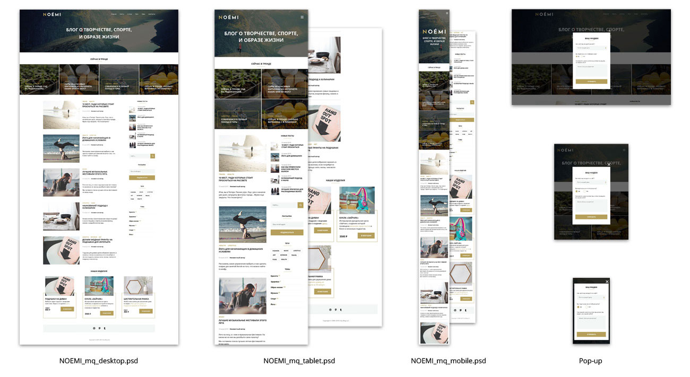

# Итоговая работа по модулю "Адаптивная и мобильная вёрстка"



Это итоговый учебный проект по курсу "Адаптивная и мобильная вёрстка" от онлайн‑школы Нетология.

Цель проекта — сверстать адаптивный веб‑сайт, который корректно отображается на устройствах с разной шириной экрана (десктопы, планшеты, смартфоны).

🔗 Задание по модулю доступно [по ссылке](https://github.com/netology-code/mq-diploma).<br>
📌 Посмотреть проект онлайн на [GitHub Pages](https://potykalov.github.io/mq-diploma/).

---

## 📝 Описание

В этом проекте реализован адаптивный сайт на **HTML и CSS**, полностью соответствующий макетам для трёх типов экранов:

- 📱 **Мобильный** — ширина до 640px
- 📲 **Планшет** — ширина от 641px до 1199px
- 🖥 **Десктоп** — ширина от 1200px и выше

---

## 📌 Основные требования

- Кроссбраузерная вёрстка (Chrome, Firefox, Edge, Opera, Safari)
- Семантическое использование тегов
- Стилизовать элементы только через CSS
- Семантические имена классов и атрибутов
- Соответствие макету дизайнера (толщина шрифта, отступы ±3px)
- Контент блоков адаптивен (можно добавлять или удалять текст/элементы)
- Высота элементов зависит от контента
- Вёрстка однотипных элементов одинакового размера
- Все ссылки работают с `href="#"`
- Изображения имеют альтернативный текст
- Текст заголовков отображается через CSS `text-transform: uppercase`
- Декоративные линии и маски реализованы через псевдоэлементы
- Все иконки и поля ввода имеют скрытое текстовое описание через класс `visually-hidden`

---

## 🚫 Ограничения

- Не использовать CSS-методологии (БЭМ, OOCSS, SMACSS)
- Не использовать готовые библиотеки и CSS-препроцессоры
- Не использовать autoprefixer
- Float и inline-block применять только по прямому назначению
- Стиль кода должен соответствовать порядку HTML-структуры

---

## 🛠 Технологии

- HTML5  
- CSS3  
- Flexbox  

---

## 📁 Структура проекта

```text
mq-diploma/
├── css/               — стили проекта
├── fonts/             — шрифты
├── images/            — изображения (растровые)
├── svg/               — векторные изображения (SVG)
├── index.html         — основная HTML страница
└── README.md          — этот файл
```

## 📄 Лицензия

Проект распространяется под лицензией MIT.  
Подробнее см. файл [LICENSE](LICENSE).
